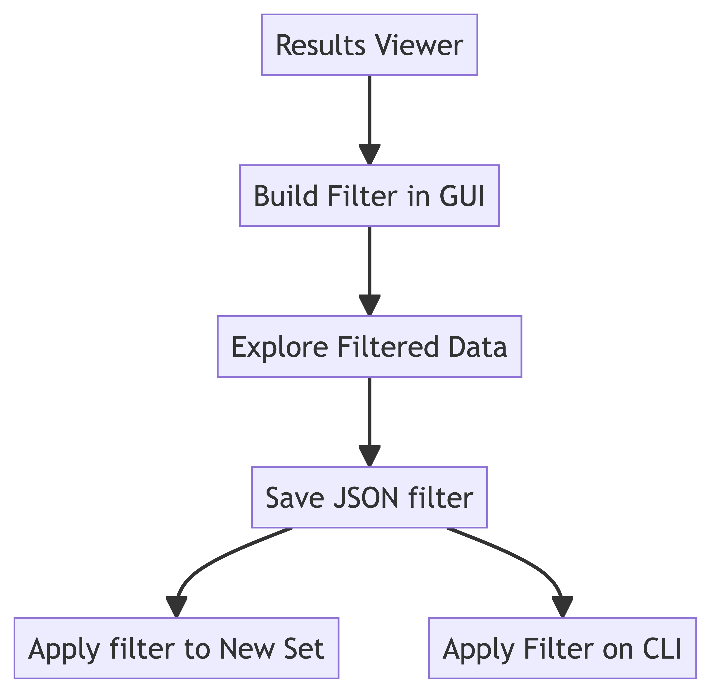

=========
Filtering
=========

Why Filter?
===========

Filtering your annotated variants lets you query interesting subsets of
your variants.

A secondary purpose of filtering is when you want to view your results
in the results viewer and you have more than 100K variants.

Filtering Roadmap
=================

.. container:: cell

   .. container:: cell-output-display

      .. container::

         .. container::

            |image1|

Filtering in the GUI
====================

Once you have your annotated results, you can filter variants in the
results viewer. There are 4 kinds of filters:

-  Samples
-  Genes
-  Sample Properties
-  Variant Properties

We will go through each of these filters and their functionality.

Samples
-------

You can remove variants associated with a set of sample IDs by
unselecting them in the checkboxes here.

Genes
-----

Gene-level filtering can be done here. You can dinput a list of genes,
separated by line-breaks

Sample Properties
-----------------

Variant Properties
------------------

Boolean Operations
==================

You can build more sophisticated operations by combining each filter
step using Boolean logic.

By default, the filters are combined using **AND** logic, which are more
restrictive. For example …

These filters can also be combined using **OR** logic, which is more
permissive (that is, these filters will return a greater number than the
**AND** logic) we might want variants that …

Exporting Filters
=================

Filters can be exported and saved as JSON files for further reuse. They
can be applied to a new set of variants in the GUI, or can be applied to
result SQLite files on the command line.

Applying filters in the GUI
===========================

Applying filters on the command line
====================================

JSON filters can also be applied on the command-line

