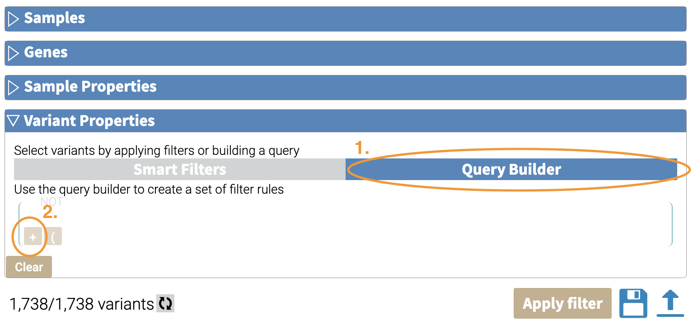
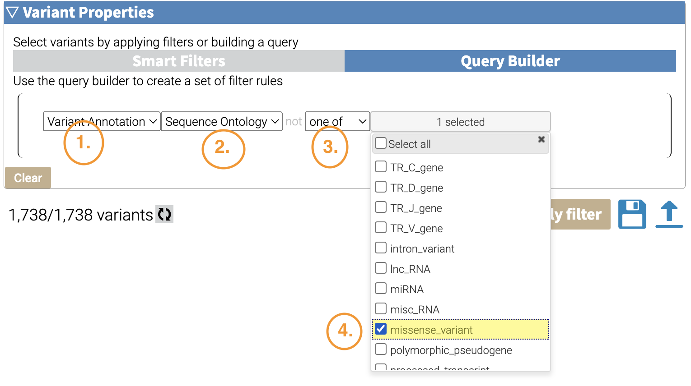
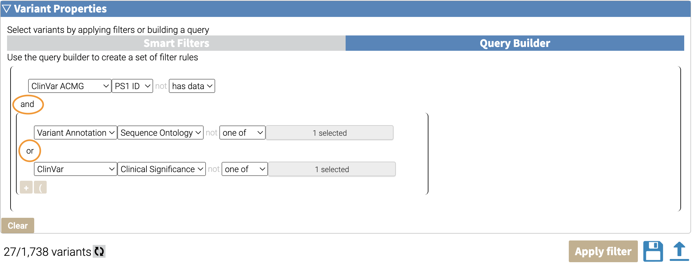

=========
Filtering
=========

Why Filter?
===========

Filtering your annotated variants lets you query interesting subsets of
your variants.

A secondary purpose of filtering is when you want to view your results
in the results viewer and you have more than 100K variants.

Filtering Roadmap
=================

.. container:: cell

   .. container:: cell-output-display

      .. container::

         .. container::

            |image1|

Filtering in the GUI
====================

Once you have your annotated results, you can filter variants in the
results viewer. There are 4 kinds of filters:

-  Samples
-  Genes
-  Sample Properties
-  Variant Properties

We will go through each of these filters and their functionality after
we talk about the common GUI elements of each.

We will use a subset of a synthetic dataset that is a trio. There are 5
individuals in this dataset.

1. The Proband
2. Mother
3. Father
4. Sibling 1
5. Sibling 2

Some of the variants are shared by the Proband and Mother, and all other
combinations.

Samples
-------

You can remove variants associated with a set of sample IDs by clicking
on the checkboxes here. For example, we want all of the variants that
are associated with the mother. We’ll click on the “mother” checkbox
until it is a green check.

|image2| If we look at the Variant tab, we can see that our variants
include multiple members:

|image3| Here’s a visual summary of the results.

.. container:: cell

   .. container:: cell-output-display

      .. container::

         .. container::

            |image4|

These are all of the variants that are associated with the mother, and
include variants that are shared by other family members. What about
variants that are *exclusive* to the mother?

For example, we can filter for

To exclude samples, click on the checkbox until you see a red x.

|image5| After filtering, we find that 385 variants are exclusive to the
mother. We can confirm this by going to the **Variant** tab:

|image6| Here’s the visual summary:

.. container:: cell

   .. container:: cell-output-display

      .. container::

         .. container::

            |image7|

Genes
-----

Gene-level filtering can be done here. You can input a list of genes,
separated by line-breaks.

Clearing our previous filter, let’s filter to only those variants that
are in BRCA1 and BRCA2.

To filter, we take the following steps in the **Gene** filter section:

1. Enter a list of genes, 1 gene per line in the text box. You can also
   upload a list of genes as well.
2. Apply the filter
3. See the results. There are 63 variants associated with BRCA1/BRCA2.

|image8| Going to the **Variant** tab, we can confirm that the variants
belong to BRCA1 and BRCA2.

|image9| Here’s the visual summary of the filter:

.. container:: cell

   .. container:: cell-output-display

      .. container::

         .. container::

            |image10|

Sample Properties
-----------------

Variant Properties
------------------

In variant properties, you can filter by variant type based on your
annotations. For example, let’s filter our dataset to missense variants.

A. Under **Variant Properties**:

1. Click on “Query Builder”.
2. Mouse into the left bottom corner of the query builder window, and
   click the “+” sign.

|image11|

B. Make your filter by selecting the values for the following dropdown
boxes:

1. Variant Annotation
2. Sequence Ontology
3. One of
4. Missense checkbox

|image12| C. Finally, click the “Apply Filter” Button:

|image13|

You will be left with 299 variants. Here’s a visual summary of what we
did:

.. container:: cell

   .. container:: cell-output-display

      .. container::

         .. container::

            |image14|

Boolean Operations
------------------

You can build more sophisticated operations by combining each filter
step using Boolean logic.

Combining Filter Interface
--------------------------

You can add another filter by clicking the **+** underneath your filter.

|image15|

AND logic
---------

By default, the filters are combined using **AND** logic, which are more
restrictive, because they require variants to meet both filters.

Here’s an example of using **AND** logic. Here we are combining two
filters: Missense Variants (from **Variant Annotation >> Sequence
Ontology**) and Pathogenic variants (from **ClinVar >> Clinical
Significance**).

|image16| Then do the following:

1. Select “ClinVar”
2. Select “Clinical Significance”
3. Select “One of”
4. Select “Pathogenic”
5. Click “Filter Result”

|image17| If we look at the **Variant** tab, we can see that our
combined filter selected both Pathogenic and Missense Variants.

|image18|

When we apply the filter, we get 9 variants that meet both criteria.
Here’s a visual summary of the filtering:

.. container:: cell

   .. container:: cell-output-display

      .. container::

         .. container::

            |image19|

OR Logic
--------

These filters can also be combined using **OR** logic, which is more
permissive (that is, these filters will return a greater number than the
**AND** logic) we might want variants that are either missense **OR**
pathogenic.

We can do this by clicking the “and” that links our two filters, which
will switch it to an “or”:

|image20| When we apply the filter, we get 300 variants. The breakdown
is below.

.. container:: cell

   .. container:: cell-output-display

      .. container::

         .. container::

            |image21|

Grouping with Parentheses
-------------------------

We can use the parentheses to group filters together. This can be
helpful when we combine different types of logic.

To make a grouped filter, click the **(** button next to the **+**
button in the interface:

|image22|

Then you can build a set of filters much like above. Notice that they
are grouped within a set of parentheses.

|image23| Keep in mind that you can nest parentheses within parentheses
to make even more complex filters. We’ll use this to be able to combine
three filters with **AND** and **OR** logic below.

Combining **AND** / **OR** logic
--------------------------------

By default, when you click the “and” / “or” of one set of filters, all
filters will be changed. If you want to combine **AND** / **OR** logic,
you can group one of the logic operations using parentheses.

For example, say we want the above **OR** subset combined as an **AND**
with those variants that have PS1 evidence. We can

This is what our final filter looks like:

|image24| Here’s a visual breakdown of this complex filter:

.. container:: cell

   .. container:: cell-output-display

      .. container::

         .. container::

            |image25|

NOT Logic
---------

If we mouse over the top left of a filter or filter group, we’ll see a
faint “NOT”.

|image26|

Clicking this will change the logic to **NOT**.

|image27|

Then we can hit **Apply Filter** again. In our case, we have 1,729
variants that do not meet our filter criterion. This makes sense because
there were 9 variants total that met our grouped criterion, and 1,738
variants total, and 1738 - 9 = 1729.

Deleting a Filter
-----------------

Finally, if you need to delete a filter, you can mouse to the right of
the filter. A faint “X” will appear. Clicking on it will delete that
filter.

|image28|

Case Study: Filtering Pathogenic Variants
-----------------------------------------

Let’s combine a sample filter with a grouped variant filter.

In our case, we want variants that are associated with the mother of the
family combined with our joint missense/pathogenic variant filter.

|image29|

.. container:: cell

   .. container:: cell-output-display

      .. container::

         .. container::

            |image30|

Exporting Filters as JSON
=========================

Filters can be exported and saved as JSON files for further reuse. They
can be applied to a new set of variants in the GUI, or can be applied to
result SQLite files on the command line.

To export your filters, click on the save icon in the bottom right:

|image31| A modal box will pop up and ask you to name your filter set:

|image32|

When you click **OK**, the filter will be saved on the top right:

|image33|

Finally, you can click on the download button for the individual filter
to save it to disk:

|image34|

Here’s an example of what a filter looks like in the JSON format:

::

   {
     "sample": {
       "require": [],
       "reject": []
     },
     "genes": [],
     "variant": {
       "operator": "and",
       "rules": [
         {
           "operator": "and",
           "rules": [
             {
               "column": "clinvar__sig",
               "test": "hasData",
               "value": null,
               "negate": false
             },
             {
               "column": "clingen__disease",
               "test": "hasData",
               "value": null,
               "negate": false
             }
           ],
           "negate": false
         }
       ],
       "negate": false
     },
     "smartfilter": {},
     "samplefilter": {
       "operator": "and",
       "rules": [],
       "negate": false
     }
   }

Applying JSON filters in the GUI
================================

JSON filters can be applied by clicking on the upload icon:

|image35|

A file select box will pop up and you can select the JSON filter to load
it:

|image36|

Then you can hit **Apply Filter** as usual to apply it.

Applying JSON filters on the command line
=========================================

JSON filters can also be applied on the command-line using the
``oc util filtersqlite`` command. `More information is
here <https://open-cravat.readthedocs.io/en/latest/Filter-And-Merge-SQLite.html>`__.

.. |image1| image:: filtering_files/figure-rst/mermaid-figure-1.png
   :width: 4.09in
   :height: 3.99in
.. |image2| image:: images/mother-filter1.png
.. |image3| image:: images/mother-all-result.png

.. |image9| image:: images/gene-filter-result.png

.. |image13| image:: images/variant-apply-filter.png

.. |image16| image:: images/and-filter.png

.. |image18| image:: images/add-filter-result.png

.. |image20| image:: images/or-filter.png

.. |image31| image:: images/save-filter.png

.. |image36| image:: images/upload-dialog.png
