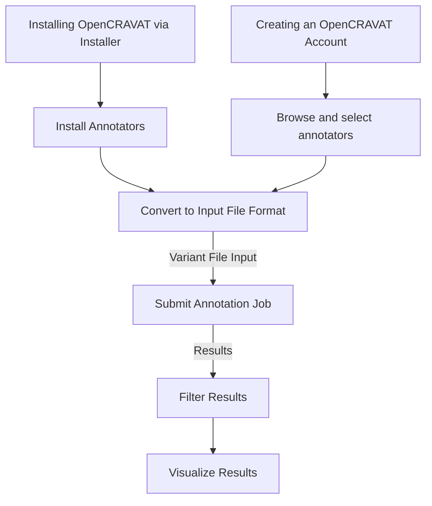
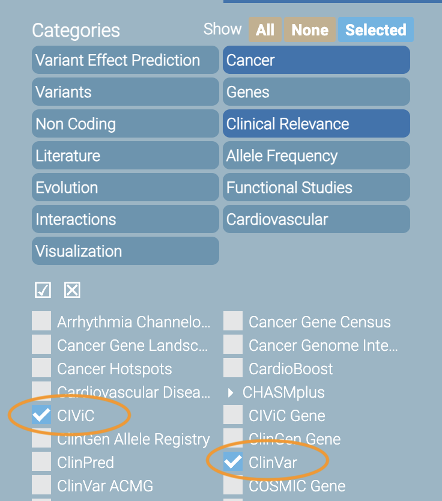
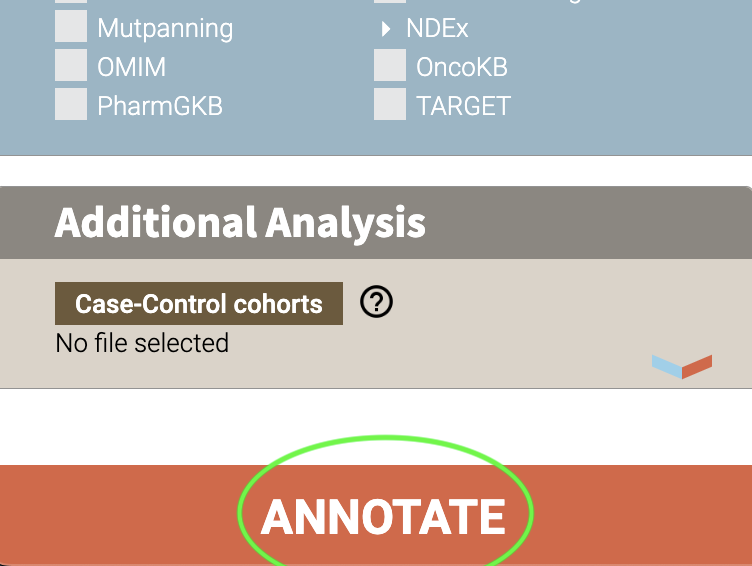
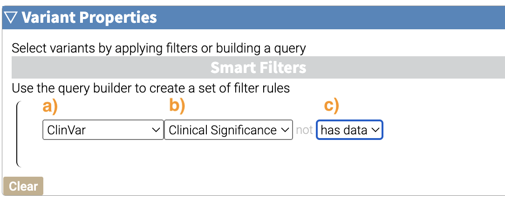
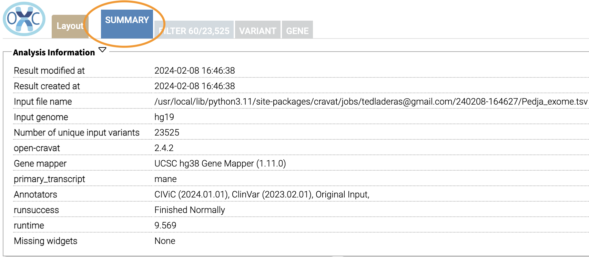
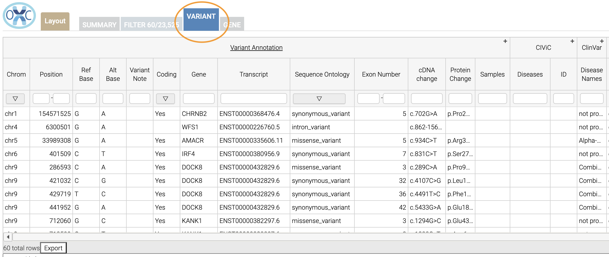

# Getting Started (Website/GUI)


- [Learning Objectives](#learning-objectives)
- [Understanding the Context for our
  Task](#understanding-the-context-for-our-task)
- [Creating an OpenCRAVAT Account
  (Web)](#creating-an-opencravat-account-web)
- [Installing OpenCRAVAT via Installer
  (Local)](#installing-opencravat-via-installer-local)
  - [Windows](#windows)
  - [MacOS](#macos)
  - [Linux](#linux)
  - [Start OpenCRAVAT GUI](#start-opencravat-gui)
- [Browse Annotators (Web)](#browse-annotators-web)
- [Convert to Input File Format](#convert-to-input-file-format)
- [Submit Annotation Job](#submit-annotation-job)
- [Filter Results](#filter-results)
- [Visualize Filtered Results](#visualize-filtered-results)
- [What you learned](#what-you-learned)

## Learning Objectives

By the end of this tutorial, you should be able to:

- **Create** as user account on the OpenCRAVAT site
- **Install** OpenCravat locally using an installer
- **Search** for available annotators on the open cravat site
- **Upload** and **annotate** variant files on the site
- **Filter** annotated results for visualization
- **Visualize** and **Summarize** Results in OpenCRAVAT
- **Export** and **Share** annotation results with others

## Understanding the Context for our Task

Let’s start with a research question we’re interested in. We have a list
of variants that we’ve found in our patient population of interest. Our
research question is:

> Given this list of variants, which are potentially pathogenic?

This research question will take us through understanding how the
OpenCRAVAT annotator works.

To start, you can either install OpenCRAVAT locally, or create an
account on the website. Then you’ll follow the paths below. Here’s a
comparison of both approaches:

| Feature            | OpenCRAVAT Web | OpenCRAVAT Local                  |
|--------------------|----------------|-----------------------------------|
| Create Account     | Yes on Web     | Not required                      |
| Install Annotators | Pre-installed  | Install in Store                  |
| Scriptable         | No             | Yes                               |
| **Protected Data** | No             | Yes, with appropriate protections |

Most importantly, **if you are using protected data, you should go the
local installer route**, with appropriate protections on your machine.

You can click on each box in the diagram below to go to the relevant
section. We’ll have an appropriate callout to highlight the differences
where the two approaches differ.



## Creating an OpenCRAVAT Account (Web)

Let’s start out by creating an account on <https://run.opencravat.org>.
If your organization is running OpenCRAVAT locally, you will need to
find out the appropriate URL for the instance of OpenCravat.

Here’s the initial screen we’ll see when we go to
<https://run.opencravat.org>. You’ll click on the **Sign Up** Button to
create an account.

 Enter your details in the form, and sign up.
You’ll automatically be signed into the interface and will be ready to
go for the next step.


Now you’re ready to browse the [OpenCRAVAT
Store](#browse-annotators-web) to look for annotators.

## Installing OpenCRAVAT via Installer (Local)

You can install OpenCRAVAT via the installers below:

### Windows

[Windows
installer](https://karchinlab.org/opencravat/installers/OpenCRAVAT-2.4.1.exe)

Windows Defender may indicate that it prevented an unknown application
from running. If so, click the ‘More’ link on the message and then
select ‘Run Anyway’. An “OpenCRAVAT” icon will be created on the Desktop
and the Start Menu.

### MacOS

<https://youtu.be/6f5fB6fVdBs>

[Mac OS
installer](https://karchinlab.org/opencravat/installers/OpenCRAVAT.2.2.9.pkg)

Right-click the downloaded file and select “Open”. Your Mac may ask you
to confirm stating that the file was not downloaded from the App Store.
Click “Open” button. Just double-clicking the installer may not enable
this “Open” option.

### Linux

Linux Users should refer to the Command Line Quickstart to install via
`pip`/`pip3`.

### Start OpenCRAVAT GUI

<https://youtu.be/cNDrAPhPffg>

Now that OpenCRAVAT is installed, we can run the GUI. In a command
prompt (PowerShell or Terminal), you can start the OpenCRAVAT GUI by
typing:

``` bash
oc gui
```

In MacOS, you can also launch OpenCRAVAT via clicking on the application
in your Applications folder. In Windows, you can click the desktop Icon
to launch it.

You should see the following in your terminal:

    tedladeras@teds-MacBook-Pro ~ % oc gui

       ____                   __________  ___ _    _____  ______
      / __ \____  ___  ____  / ____/ __ \/   | |  / /   |/_  __/
     / / / / __ \/ _ \/ __ \/ /   / /_/ / /| | | / / /| | / /   
    / /_/ / /_/ /  __/ / / / /___/ _, _/ ___ | |/ / ___ |/ /    
    \____/ .___/\___/_/ /_/\____/_/ |_/_/  |_|___/_/  |_/_/     
        /_/                                                     

    OpenCRAVAT is served at localhost:8080
    (To quit: Press Ctrl-C or Ctrl-Break if run on a Terminal or Windows, or click "Cancel" and then "Quit" if run through OpenCRAVAT app on Mac OS)
    (Getting result of [example_input.sqlite]:[variant]...)
    Done getting result of [example_input.sqlite][variant] in 0.029s
    (Getting result of [example_input.sqlite]:[gene]...)
    Done getting result of [example_input.sqlite][gene] in 0.021s

A window should open in your web browser. If not, enter
<https://localhost:8080> to view the GUI.

Now you can [browse and install the available
annotators](#browse-annotators)

## Browse Annotators (Web)

<https://youtu.be/B2jiQcIkX8c>

If we click on the **STORE** tab in the top left of the interface, we’ll
see the variety of annotators that are available to us.


Let’s browse the clinically relevant annotators by clicking on the
`Clinically Relevant` checkbox:


As we browse the annotators available to us, we notice two specific
annotators we want to work with. Let’s use two clinically relevant
annotators: [CiViC](https://civicdb.org/welcome) (Clinical
Interpretations of Variants in Cancer) and
[ClinVar](https://www.ncbi.nlm.nih.gov/clinvar/), a public archive of
interpretations of clinically relevant patients.

To get more information, click on the CiViC box:

 And you’ll see more information
about the annotator:


> [!NOTE]
>
> ### For Local Users
>
> If you have installed OpenCRAVAT locally, you will have the option to
> install annotators on the store page. You can do this by clicking
> “Install” for the annotator of interest. Please note that some of the
> annotators use a lot of disk space, so keep that in mind before
> installing locally.
>
> 
>
> You already have CiViC and ClinVar installed by default, so you don’t
> need to install them locally.

Now we know which annotators we want to use, let’s [review input file
formats](#convert-to-input-file-format).

## Convert to Input File Format

OpenCRAVAT supports VCF files for input, but also has a simplified
format to be used for input files.

We’ll use an example and annotate it. Let’s take a look at the first few
lines of this file to understand the input format. This example is
available by clicking the “TSV” button next to “example”:


    chr1    69091   +   A   C   s0
    chr1    69091   +   ATG C   s0
    chr6    31039077    +   C   G   s0
    chr1    27612918    +   G   a   s1
    chr1    27612918    +   G   A   s0
    chrM    235 +   A   G   clinvar
    chrM    3308    +   T   C   omim
    chr8    54626835    +   A   T   s0
    chr4    1804372 +   A   G   s1
    chr4    1804372 +   AT  GC  s1
    chr4    1804372 +   A   T   s1
    chr1    369551  +   G   C   s0
    chr10   121593817   -   A   T   s0
    chr10   2987654 +   T   A   s1

This format contains the following columns: `chromosome`, `position`,
`strand`, `reference`, `allele`, and `sample`.

Much more information about the supported file formats are here: [File
Formats](https://open-cravat.readthedocs.io/en/latest/File-Formats.html).

> [!NOTE]
>
> ### For Local Users
>
> You can download the example to annotate [here]().

Now we have our input file, we can move on to [submitting our
job](#submit-annotation-job).

## Submit Annotation Job

<https://youtu.be/xSOxEbsW--c>

Before we move on, let’s take a look at the overall workflow for
annotating in the GUI. We’ll start out by 1) submitting our input file,
2) selecting the annotators, and then 3) submitting our job.


1.  Let’s start the workflow. We can now add our variant file to
    annotate and submit a job. Select the `JOBS` tab in the top left
    corner of the interface.


Our example file corresponds to the `hg19/GRCH37` build, so make sure
that this genome is selected under the Genome field


Now we’ll add our input file. Add your variant file here by clicking the
“ADD INPUT FILES” button. If you are using the built in example, you
won’t need to add it.


2.  Now we can select our annotators. Under annotations in the box below
    “Variants”, click on the “Clinical Relevance” category.


Select the `CiViC` (not `CiViC Gene`) and `ClinVar` annotation
checkboxes.



3.  Now we’re ready to annotate. Click the **ANNOTATE** button at the
    bottom of the webpage. Now you’ve submitted your job.



Depending on the size of your Variant file, it may take time for your
job to finish. You’ll see the job running in the table on the right of
the interface.

When our job is finished, we can [view our results and filter
them](#filter-results).

## Filter Results

<https://youtu.be/TYs3dGDFzQQ>

> We are interested in those variants that have ClinVar annotation. How
> do we find those?

Now we take a look at our results in the web interface. Under the list
of jobs, we can see our job. Let’s select `Open Result Viewer` under the
**Status** tab:

 Keep in mind that the web interface is
limited to visualizing 100,000 variants, so if you have a larger result
file, you’ll need to filter the results down. So let’s take a look at
how to filter our variants down.

We can filter variants by selecting the Filter tab in the Results
viewer:


Under “Variant Properties” we can limit our list of variants to those
that have ClinVar annotations. Let’s build a filter using the Query
Builder, which will allow us to impose multiple criteria as a filter.


We’ll add a rule (a logical condition) to our filter using the `+`
button:


Now we’ll add a rule and select those that have `ClinVar` annotations.
To do this, we’ll first select a) `ClinVar` on the left, the b)
`Clinical Significance` column, and c) `has data`:

 Now we can apply this rule we’ve built
by clicking on the **Apply Filter** button on the bottom right of the
Query Builder:

 How many variants are left after the
filtering?

> [!NOTE]
>
> ### Calculating the Effect of Filters
>
> If you have multiple filters, you can actually precalculate the
> numbers of variants after filtering by using the icon below.
>
> 
>
> This can be helpful to check if your filters are too strict (that is,
> they won’t return anything).
>
> Just note that the filter is not actually applied to the data until
> you hit the **Apply Filter** Button.

## Visualize Filtered Results

<https://youtu.be/MPW2MXBJG7w>

Now that we’ve filtered, let’s go back to the Summary Tab:

 In the Summary tab, we can see
information about the annotated variants, such as from the sequence
ontology. We can get the counts within a sequence ontology category by
mousing over that category in our plot:

 These visualizations can be
moved around and pinned. Using the camera icon, you can also save these
visualizations.

Let’s move over to the **Variant** tab and look for pathogenic variants.
First, we’ll click over to the **Variant** tab:

 Scrolling to the right, we can see
there is a column for the ClinVar annotations. Notice the **+** on the
top right. We’ll click that to expand the ClinVar annotations:

 In the **Clinical Significance**
column, we can see that we can filter. Let’s select those variants that
have **pathogenic** significance. Clicking into the search box
underneath this column, we can select **pathogenic**:


How many variants are pathogenic?

The last thing we might want to do is to export our results. We can use
the export button at the bottom of the table:


When you click that, you will have the option to export the variant
level results as a tab seperated value (TSV) file. Note that this result
table will have filters applied to it as well.

> [!NOTE]
>
> ### Multiple Rules
>
> Note that we could have limited our search to pathogenic variants by
> adding another filter rule like we did above in the filtering step.
> We’re showing this way in case you didn’t know the available
> categories within the `Clinical Significance` column.

## What you learned

You learned a lot in this section. You learned how to:

- Create a User Account
- Browse OpenCRAVAT’s store to look for annotators
- Submit a job to the Open-Cravat server
- Filter results in the Results Viewer
- Visualize results in the Results Viewer
